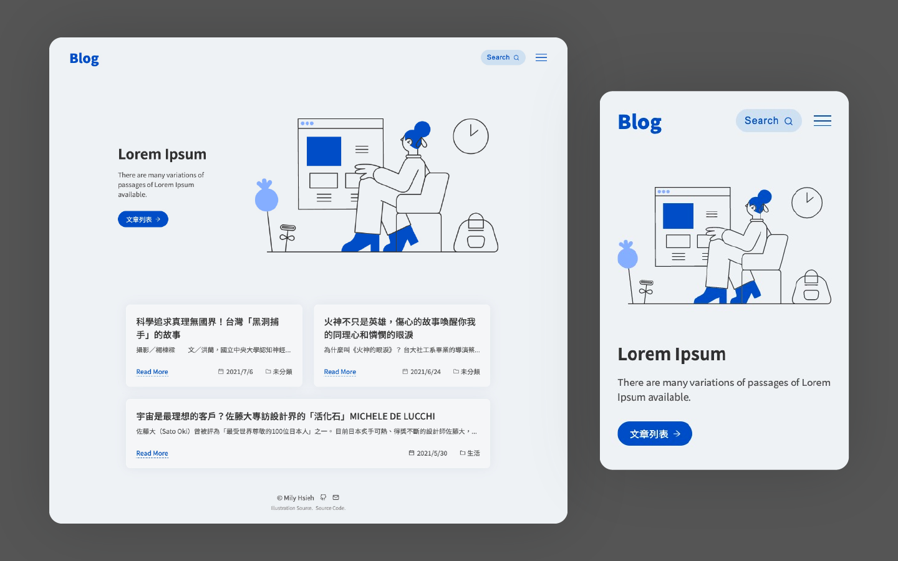
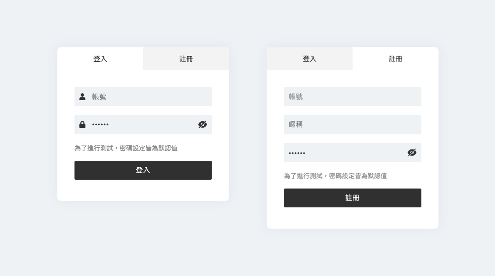
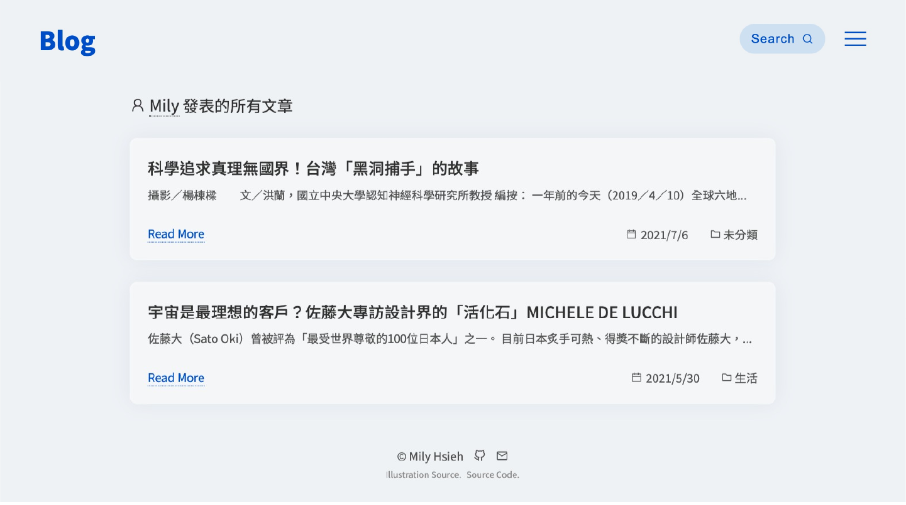
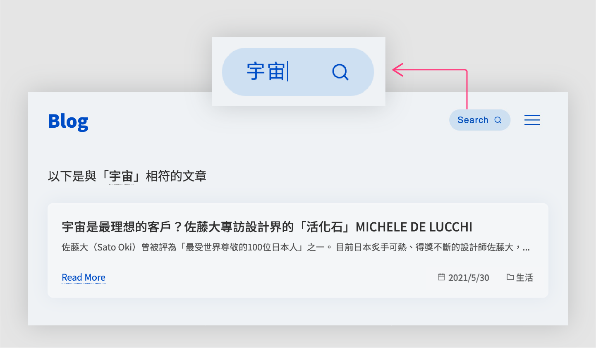

## React Blog

使用 [Create React App](https://github.com/facebook/create-react-app) 開發，並串接 [Lidemy API](https://github.com/Lidemy/lidemy-student-json-api-server) 的 SPA Blog。

☞ [DEMO](https://milyzoo.github.io/lidemy-react-blog/)



## 功能

- 開放使用者註冊及登入功能
- 使用者在登入狀態下可以新增、編輯、刪除文章
- 檢視所有文章功能，支援分頁功能，一頁顯示 5 篇，文章排序由新至舊排列
- 點擊文章標題或 Read More 可以檢視文章完整資訊
- 點擊作者名稱，可以進一步查看作者所發布的文章
- 提供標題及文章內容關鍵字搜尋
- 支援深色模式，並將切換後的模式記錄於 localStorage

## 使用技術

- 以 React 開發，搭配 React-router 處理前端路由，實現 Single-page application
- 使用 function component 並導入 Hooks 來管理組件狀態
- 支援 RWD，使用 styled-components 進行排版
- 搭配 Prettier、ESLint 統一程式碼格式

## 功能說明

### 會員機制

由於此系統的密碼以明文儲存，所以會在後端統一將密碼設置成 Lidemy，因此每個使用者的密碼將會相同。



### 作者文章列表

點擊文章上的作者名稱，即可瀏覽該作者的文章列表。



### 搜尋功能

於上方搜尋欄位輸入關鍵字，即會列出其標題或文章內容有符合關鍵字的文章。



### Responsive Web Design

支援不同的裝置瀏覽。


## Installation & 本機端啟動

如果要在本機端啟動專案，需先安裝 Node.js 再進行以下步驟。

### 下載專案

首先將專案下載至本機端。

```
$ git clone https://github.com/milyzoo/lidemy-react-blog.git
```

### 安裝套件

```
$ npm install
```

### 啟動專案

啟動後，可於任一瀏覽器以 http://localhost:3000 進行結果預覽。

```
$ yarn start
```
